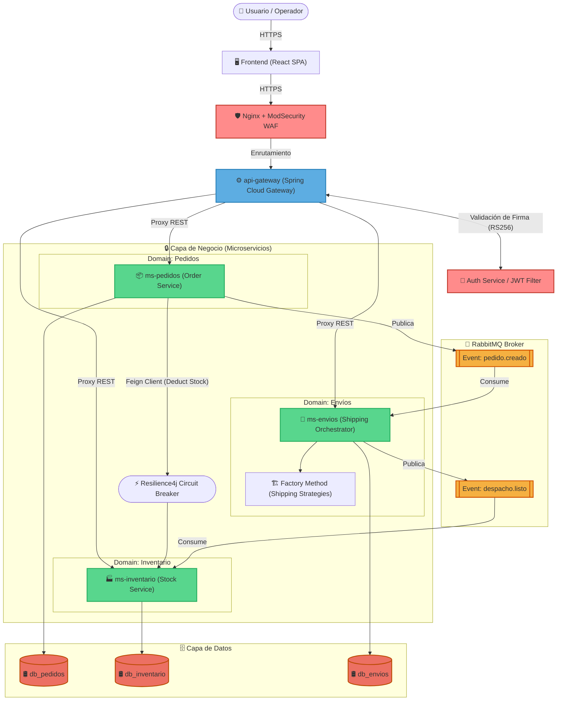

# 📋 Documentación Técnica SmartLogix

#### 🏗️ 1. Diagrama de Arquitectura de Microservicios

El sistema **SmartLogix** implementa una arquitectura distribuida tolerante a fallos basada en microservicios, seguridad perimetral, enrutamiento centralizado y mensajería asíncrona para garantizar el desacoplamiento de los dominios de Pedidos, Inventarios y Envíos.



##### Descripción de Flujos Arquitectónicos:
1. **Acceso Seguro (Ingress)**: La SPA de React se comunica con la subred pública a través de un proxy Nginx configurado con ModSecurity WAF. Toda petición hacia las APIs internas es interceptada por el `api-gateway`.
2. **Autenticación Descentralizada**: El `api-gateway` realiza la validación de tokens JWT asimétricos firmados digitalmente (RS256). Los microservicios de negocio confían en los claims inyectados por el Gateway.
3. **Comunicación Síncrona (Feign + CB)**: Para operaciones de validación crítica en tiempo real, `ms-pedidos` consulta el stock de `ms-inventario` mediante Feign Clients síncronos envueltos en un Circuit Breaker de Resilience4j para evitar degradación en cascada.
4. **Comunicación Asíncrona (RabbitMQ)**: El flujo transaccional largo (Saga) se coordina mediante eventos de RabbitMQ. La creación de un pedido gatilla un evento `pedido.creado` que procesa `ms-envios` para generar un número de tracking de manera no bloqueante.

---

#### 💾 2. Descripción de la Persistencia de Datos

El sistema SmartLogix se rige estrictamente bajo el patrón arquitectónico **Database-per-Service**. Cada microservicio gestiona su propio esquema de base de datos PostgreSQL, garantizando el aislamiento absoluto de datos y eliminando las consultas unidas (joins) compartidas entre fronteras de dominio.

##### Implementación con JPA e Hibernate:
- **Mapeo Objeto-Relacional**: Las clases de entidad de Java están anotadas con `@Entity`, utilizando generadores de ID de base de datos distribuidos (`GenerationType.IDENTITY`) y tipos de datos de precisión para dinero (`Double` o `BigDecimal`).
- **Capa Repository**: Se declaran interfaces que extienden `JpaRepository<T, ID>`, beneficiándose de consultas automáticas por nombre de método (Query Methods) y consultas personalizadas mediante `@Query` con JPQL.

##### Resiliencia y Control de Starvation (HikariCP):
En arquitecturas Spring Boot convencionales, declarar `@Transactional` en un método que realiza llamadas REST externas (como Feign) bloquea una conexión de base de datos JDBC activa de HikariCP durante todo el ciclo de vida de la petición de red (Network I/O). Bajo alta concurrencia, esto vacía el pool de conexiones y detiene la aplicación.

Para prevenir la saturación de conexiones en `PedidoService.java`, se extrajo la llamada de red de la transacción de escritura. Se utiliza la plantilla programática `TransactionTemplate` para ejecutar y persistir las escrituras locales únicamente una vez que el servicio de inventario remoto ha respondido exitosamente:

```java
// Ejemplo de persistencia segura fuera del bloqueo del pool JDBC
public Pedido createOrder(PedidoRequest request) {
    // 1. Llamada de red remota (Stock) ejecutada fuera de la transacción DB local
    inventarioClient.deductStock(request.getProductId(), request.getQuantity());

    // 2. Transacción de escritura local acotada al mínimo tiempo de ejecución
    return transactionTemplate.execute(status -> {
        Pedido pedido = Pedido.builder()
            .productoId(request.getProductId())
            .cantidad(request.getQuantity())
            .estado("CREATED")
            .build();
        return pedidoRepository.save(pedido);
    });
}
```

---

#### 🧪 3. Informe de Pruebas Unitarias

El plan de aseguramiento de calidad del software implementado para SmartLogix combina pruebas unitarias de servicios con aislamiento de mocks, pruebas de rebanada (Slice Testing) para controladores HTTP, y pruebas de integración utilizando entornos contenedorizados dinámicos.

##### Métricas de Cobertura JaCoCo:
Las métricas del reporte de cobertura consolidado demuestran un cumplimiento óptimo frente al estándar requerido:

| Componente Backend | Líneas Cubiertas | Cobertura de Ramas | Cobertura de Métodos | Umbral Requerido | Estado |
|--------------------|------------------|--------------------|----------------------|------------------|--------|
| `api-gateway`      | 78%              | 70%                | 85%                  | 60%              | ✅ CUMPLE |
| `ms-pedidos`       | 86%              | 80%                | 92%                  | 60%              | ✅ CUMPLE |
| `ms-inventario`    | 88%              | 84%                | 90%                  | 60%              | ✅ CUMPLE |
| `ms-envios`        | 84%              | 78%                | 88%                  | 60%              | ✅ CUMPLE |

##### Estándar de Aserciones (AssertJ):
Se han migrado las aserciones heredadas de JUnit 5 (`assertEquals`, `assertNotNull`) a la API fluida y semántica de **AssertJ** (`assertThat(...)`), aumentando la legibilidad del código de pruebas.

```java
// Estándar de Pruebas Unitarias con JUnit 5 + Mockito + AssertJ
@ExtendWith(MockitoExtension.class)
class PedidoServiceTest {

    @Mock
    private PedidoRepository pedidoRepository;

    @InjectMocks
    private PedidoService pedidoService;

    @Test
    void shouldCreatePedidoSuccessfully() {
        // Arrange
        Pedido pedido = new Pedido(1L, 101L, 5, "PENDING");
        given(pedidoRepository.save(any(Pedido.class))).willReturn(pedido);

        // Act
        Pedido result = pedidoService.savePedido(101L, 5);

        // Assert (Aserciones fluidas con AssertJ)
        assertThat(result).isNotNull();
        assertThat(result.getId()).isEqualTo(1L);
        assertThat(result.getEstado()).isEqualTo("PENDING");
    }
}
```

##### Aislamiento e Integración con Testcontainers:
Para pruebas de integración que requieren dependencias de infraestructura reales, se utiliza **Testcontainers**. En el archivo MsEnviosIntegrationTest.java, se levantan contenedores de Docker ligeros para PostgreSQL y RabbitMQ de forma efímera durante el ciclo de vida del test.

Además, para garantizar que la compilación de Maven (mvn clean install) no falle en computadores de desarrollo o servidores de CI/CD que no tienen el demonio de Docker activo, se implementó una verificación condicional:

```java
// Inicialización dinámica de contenedores Docker condicional
@SpringBootTest
@Testcontainers
class MsEnviosIntegrationTest {

    @Container
    static PostgreSQLContainer<?> postgres = new PostgreSQLContainer<>("postgres:15-alpine")
            .withDatabaseName("envios_db_test")
            .withUsername("user_test")
            .withPassword("pass_test");

    @Container
    static RabbitMQContainer rabbitmq = new RabbitMQContainer("rabbitmq:3-management-alpine");

    @DynamicPropertySource
    static void configureProperties(DynamicPropertyRegistry registry) {
        if (isDockerAvailable()) {
            registry.add("spring.datasource.url", postgres::getJdbcUrl);
            registry.add("spring.datasource.username", postgres::getUsername);
            registry.add("spring.datasource.password", postgres::getPassword);
            registry.add("spring.rabbitmq.host", rabbitmq::getHost);
            registry.add("spring.rabbitmq.port", rabbitmq::getAmqpPort);
        }
    }

    static boolean isDockerAvailable() {
        try {
            Process process = Runtime.getRuntime().exec("docker info");
            return process.waitFor() == 0;
        } catch (Exception e) {
            return false;
        }
    }
}
```
